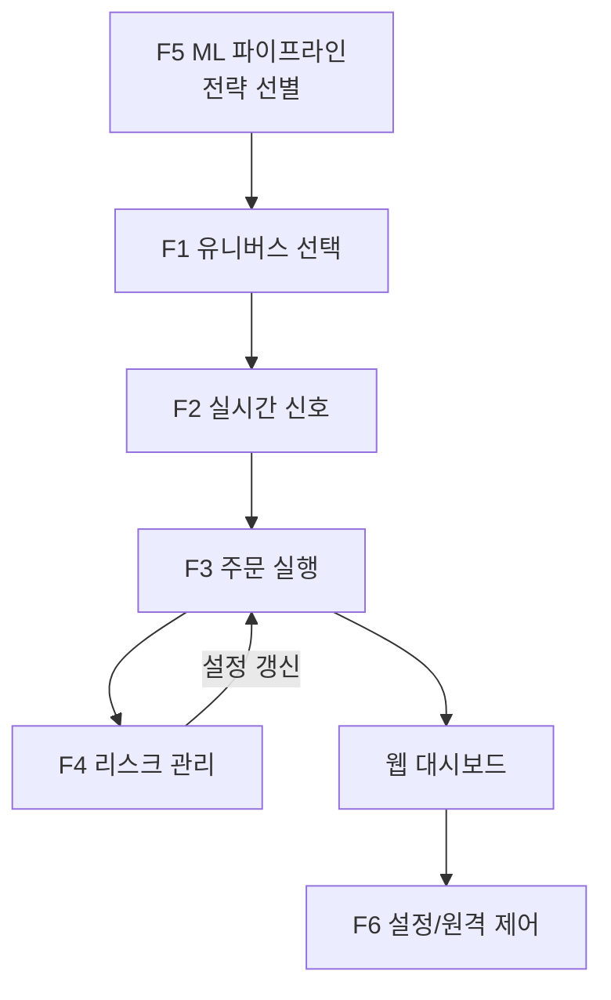

# UPBIT 자동매매 시스템 개요

이 문서는 프로젝트 전체 구조와 주요 동작 흐름을 초보 기획자 관점에서 설명합니다. 각 단계의 역할, 관련 파일과 함수, 생성되는 로그를 한눈에 확인할 수 있도록 정리했습니다.

## 전체 플로우 차트

## 1. F1 유니버스 선택
- **역할**: 매수·매도 대상이 될 코인 목록을 결정합니다.
- **주요 파일**: `f1_universe/universe_selector.py`
- **주요 함수**
  - `load_monitoring_coins()` – 모니터링 코인 리스트 로드 【F:f1_universe/universe_selector.py†L47-L67】
  - `load_selected_universe()` – ML 파이프라인에서 선별한 코인 로드 【F:f1_universe/universe_selector.py†L159-L169】
  - `select_universe()` – 최종 유니버스 결정 【F:f1_universe/universe_selector.py†L116-L142】
  - `update_universe()` – 결과를 `config/current_universe.json`에 저장 【F:f1_universe/universe_selector.py†L145-L156】
  - `schedule_universe_updates()` – 주기적 갱신 스레드 시작 【F:f1_universe/universe_selector.py†L204-L216】
- **로그**: `logs/F1_signal_engine.log`, `logs/F1-F2_loop.log`

## 2. F2 실시간 매수 신호
- **역할**: 최근 1분봉 데이터를 이용해 머신러닝으로 매수 가능성을 판단합니다.
- **주요 파일**: `f2_ml_buy_signal/02_ml_buy_signal.py`, `f2_ml_buy_signal/01_buy_indicator.py`, `f2_ml_buy_signal/03_buy_signal_engine/signal_engine.py`
- **주요 함수**
  - `run()` – 모니터링 리스트를 순회하며 매수 신호 계산 【F:f2_ml_buy_signal/02_ml_buy_signal.py†L323-L392】
  - `run_if_monitoring_list_exists()` – 모니터링 파일이 있을 때만 실행 【F:f2_ml_buy_signal/02_ml_buy_signal.py†L395-L401】
  - `f2_signal()` – 실시간 루프에서 호출되는 신호 계산 함수 【F:f2_ml_buy_signal/03_buy_signal_engine/signal_engine.py†L34-L54】
- **로그**: `logs/f2_ml_buy_signal.log`, `logs/F2_signal_engine.log`

## 3. F3 주문 실행기
- **역할**: F2에서 전달된 매수/매도 신호를 실제 주문으로 전환하고 포지션을 관리합니다.
- **주요 파일**: `f3_order/order_executor.py`, `f3_order/position_manager.py`, `f3_order/smart_buy.py`
- **주요 함수**
  - `OrderExecutor.entry()` – 매수 신호 처리 후 주문 실행 【F:f3_order/order_executor.py†L122-L172】
  - `OrderExecutor.manage_positions()` – 보유 포지션 상태 관리 【F:f3_order/order_executor.py†L174-L177】
- **로그**: `logs/F3_order_executor.log`, `logs/F3_position_manager.log`

## 4. F4 리스크 매니저
- **역할**: 계좌 손실 한도, MDD 등 위험 조건을 감시하여 매매를 일시 중단(PAUSE)하거나 전면 중단(HALT)합니다.
- **주요 파일**: `f4_riskManager/risk_manager.py`, `f4_riskManager/risk_config.py`
- **주요 함수**
  - `update_account()` – 계좌 손익 정보를 업데이트 【F:f4_riskManager/risk_manager.py†L64-L75】
  - `check_risk()` – 손실 한도 초과 여부 판단 【F:f4_riskManager/risk_manager.py†L89-L108】
  - `pause()` / `halt()` – 상태 전이 및 포지션 강제 정리 【F:f4_riskManager/risk_manager.py†L112-L157】
  - `hot_reload()` – 설정 파일 변경 시 즉시 반영 【F:f4_riskManager/risk_manager.py†L161-L175】
  - `periodic()` – 메인 루프에서 1초 간격으로 호출 【F:f4_riskManager/risk_manager.py†L177-L190】
- **로그**: `logs/F4_risk_manager.log`, `logs/risk_fsm.log`, `logs/risk_events.db`

## 5. F5 ML 파이프라인
- **역할**: 대량의 과거 데이터를 이용해 LightGBM 모델을 학습하고 백테스트 결과로 우수 전략을 선별합니다.
- **주요 파일**: `f5_ml_pipeline/00_72h_1min_data.py` ~ `10_select_best_strategies.py`, `f5_ml_pipeline/run_pipeline.py`
- **데이터 경로**: `f5_ml_pipeline/ml_data/` 하위 폴더에 단계별 데이터가 저장됩니다.
- **로그**: 각 단계별로 `logs/F5_<step>.log` 형식의 파일이 생성됩니다.

## 6. F6 설정/원격 제어
- **역할**: 웹 대시보드에서 매수 금액, 위험 설정, 텔레그램 알림 등을 관리하고, 원격으로 자동매매 ON/OFF 상태를 제어합니다.
 - **주요 파일**: `f6_setting/buy_config.py`, `f6_setting/sell_config.py`, `f6_setting/alarm_control.py`, `f6_setting/remote_control.py`
 - **주요 함수**
   - `load_buy_config()` / `save_buy_config()` – 매수 관련 설정 로드·저장 【F:f6_setting/buy_config.py†L11-L27】
   - `load_sell_config()` / `save_sell_config()` – 매도 관련 설정 로드·저장 【F:f6_setting/sell_config.py†L1-L27】
   - `read_status()` / `write_status()` – 자동매매 상태 파일 관리 【F:f6_setting/remote_control.py†L15-L27】
- **로그**: 웹 관련 이벤트는 `logs/events.jsonl`에 기록됩니다.

## 동작 흐름 요약
1. **전략 선별(F5)**에서 추천된 코인이 `config/f5_f1_monitoring_list.json`에 저장됩니다.
2. **유니버스 선택(F1)**이 주기적으로 실행되어 모니터링 코인을 결정하고 `config/current_universe.json`에 기록합니다.
3. **신호 계산(F2)**이 `signal_loop.py`에서 15초 주기로 호출되어 각 코인의 매수/매도 신호를 구합니다.
4. **주문 실행(F3)**이 신호를 받아 주문을 전송하고, 포지션 정보를 `config/f1_f3_coin_positions.json`에 업데이트합니다.
5. **리스크 매니저(F4)**가 포지션과 손익을 감시하여 필요 시 일시 중단이나 중단 상태로 전환합니다.
6. 전체 과정은 **웹 대시보드**에서 실시간으로 조회 가능하며, 텔레그램 알림과 원격 제어 기능(F6)이 지원됩니다.

