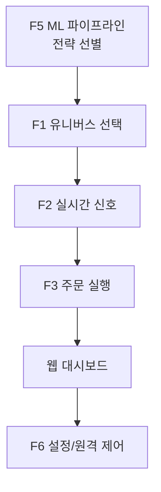

# UPBIT 자동매매 시스템 개요

이 문서는 프로젝트 전체 구조와 주요 동작 흐름을 초보 기획자 관점에서 설명합니다. 각 단계의 역할, 관련 파일과 함수, 생성되는 로그를 한눈에 확인할 수 있도록 정리했습니다.

## 전체 플로우 차트



## 1. F1 유니버스 선택
- **역할**: 매수·매도 대상이 될 코인 목록을 결정합니다.
- **주요 파일**: `f1_universe/universe_selector.py`
- **주요 함수**
  - `load_monitoring_coins()` – 모니터링 코인 리스트 로드 【F:f1_universe/universe_selector.py†L47-L67】
  - `load_selected_universe()` – ML 파이프라인에서 선별한 코인 로드 【F:f1_universe/universe_selector.py†L159-L169】
  - `select_universe()` – 최종 유니버스 결정 【F:f1_universe/universe_selector.py†L116-L142】
  - `update_universe()` – 결과를 `config/current_universe.json`에 저장 【F:f1_universe/universe_selector.py†L145-L156】
  - `schedule_universe_updates()` – 주기적 갱신 스레드 시작 【F:f1_universe/universe_selector.py†L204-L216】
- **로그**: `logs/F1_signal_engine.log`, `logs/F1-F2_loop.log`

## 2. F2 실시간 매수 신호
- **역할**: 최근 1분봉 데이터를 이용해 머신러닝으로 매수 가능성을 판단합니다.
- **주요 파일**: `f2_buy_signal/02_ml_buy_signal.py`, `f2_buy_signal/01_buy_indicator.py`, `f2_buy_signal/03_buy_signal_engine/signal_engine.py`
- **주요 함수**
  - `check_signals(symbol)` – `f5_ml_pipeline/ml_data/08_pred/{symbol}_pred.csv`를 읽어 세 신호를 계산한 뒤 딕셔너리로 반환합니다.

    ```python
    check_signals("KRW-BTC")
    # {"signal1": True, "signal2": False, "signal3": True}
    ```
- **로그**: `logs/f2/f2_buy_signal.log`

## 3. F3 주문 실행기
- **역할**: F2에서 전달된 매수/매도 신호를 실제 주문으로 전환하고 포지션을 관리합니다.
- **주요 파일**: `f3_order/order_executor.py`, `f3_order/position_manager.py`, `f3_order/smart_buy.py`
- **주요 함수**
  - `OrderExecutor.entry()` – 매수 신호 처리 후 주문 실행 【F:f3_order/order_executor.py†L122-L172】
  - `OrderExecutor.manage_positions()` – 보유 포지션 상태 관리 【F:f3_order/order_executor.py†L174-L177】
- **로그**: `logs/F3_order_executor.log`, `logs/F3_position_manager.log`

## 4. F5 ML 파이프라인
- **역할**: 대량의 과거 데이터를 이용해 LightGBM 모델을 학습하고 백테스트 결과로 우수 전략을 선별합니다.
- **주요 파일**: `f5_ml_pipeline/00_72h_1min_data.py` ~ `10_select_best_strategies.py`, `f5_ml_pipeline/run_pipeline.py`
- **데이터 경로**: `f5_ml_pipeline/ml_data/` 하위 폴더에 단계별 데이터가 저장됩니다.
- **로그**: 각 단계별로 `logs/F5_<step>.log` 형식의 파일이 생성됩니다.

## 5. F6 설정/원격 제어
- **역할**: 웹 대시보드에서 매수 금액, 위험 설정, 텔레그램 알림 등을 관리하고, 원격으로 자동매매 ON/OFF 상태를 제어합니다.
 - **주요 파일**: `f6_setting/buy_config.py`, `f6_setting/sell_config.py`, `f6_setting/alarm_control.py`, `f6_setting/remote_control.py`
 - **주요 함수**
   - `load_buy_config()` / `save_buy_config()` – 매수 관련 설정 로드·저장 【F:f6_setting/buy_config.py†L11-L27】
   - `load_sell_config()` / `save_sell_config()` – 매도 관련 설정 로드·저장 【F:f6_setting/sell_config.py†L1-L27】
   - `read_status()` / `write_status()` – 자동매매 상태 파일 관리 【F:f6_setting/remote_control.py†L15-L27】
- **로그**: 웹 관련 이벤트는 `logs/events.jsonl`에 기록됩니다.

## 동작 흐름 요약
1. **전략 선별(F5)**에서 추천된 코인이 `config/f5_f1_monitoring_list.json`에 저장됩니다.
2. **유니버스 선택(F1)**이 주기적으로 실행되어 모니터링 코인을 결정하고 `config/current_universe.json`에 기록합니다.
3. **신호 계산(F2)**은 F5 파이프라인의 예측 결과가 생성될 때마다 실행되어 각 코인의 매수/매도 신호를 구합니다.
4. **주문 실행(F3)**이 신호를 받아 주문을 전송하고, 포지션 정보를 `config/f1_f3_coin_positions.json`에 업데이트합니다.
5. 전체 과정은 **웹 대시보드**에서 실시간으로 조회 가능하며, 텔레그램 알림과 원격 제어 기능(F6)이 지원됩니다.

