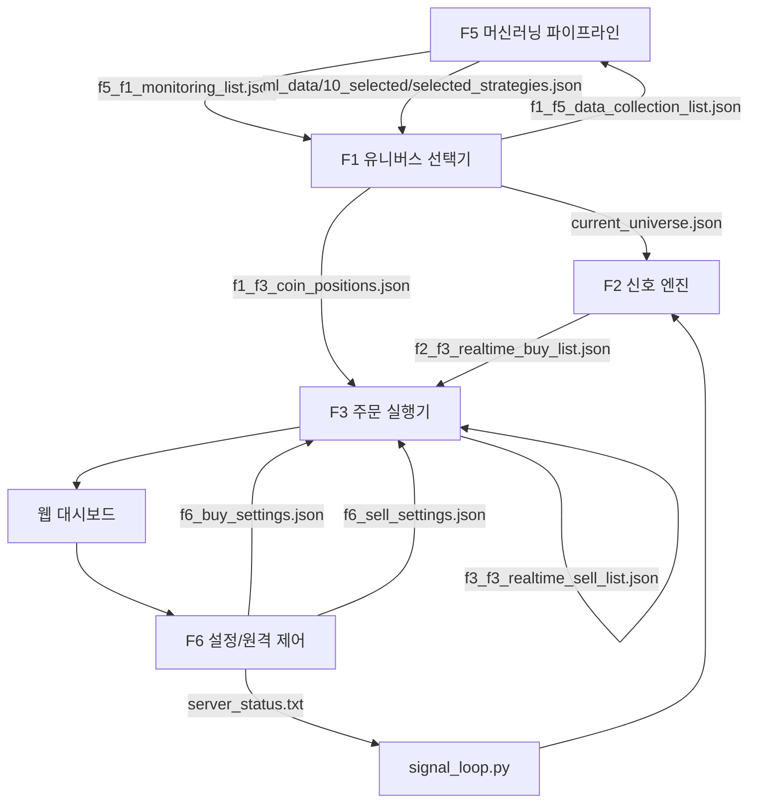

# 엔진별 설정 파일 흐름도

이 문서는 시스템 구성 요소가 어떤 설정 파일을 생성하고 소비하는지 한눈에 보여주는 플로우 차트를 제공합니다. 각 파일의 위치는 `config/` 폴더 기준으로 표기했습니다.

## 파일별 역할 요약

- **f5_f1_monitoring_list.json**: F5가 추천한 모니터링 코인 목록입니다. F1과 F2가 읽어 실시간 감시 대상을 결정합니다.
- **current_universe.json**: F1이 선택한 최종 유니버스가 저장되며, `signal_loop.py`가 이 파일을 읽어 F2 신호 계산에 사용합니다.
- **f1_f5_data_collection_list.json**: F1이 관리하는 학습용 코인 리스트로 F5 데이터 수집 단계에서 소비됩니다.
- **f1_f3_coin_positions.json**: 초기 잔고 동기화 결과를 담고 F3 주문 모듈이 포지션 정보를 업데이트할 때 참조합니다.
- **f2_f3_realtime_buy_list.json**: F2가 매수 후보를 기록하면 F3가 이 목록을 읽어 실제 주문을 시도합니다.
- **f3_f3_realtime_sell_list.json**: 보유 중인 심볼을 저장하여 중복 매수를 방지하며, F3 주문 모듈이 직접 갱신합니다.
- **f6_buy_settings.json / f6_sell_settings.json**: 웹 UI에서 수정되는 매수·매도 기본 설정입니다. 변경 사항이 즉시 F3와 위험 관리 로직에 반영됩니다.
- **server_status.txt**: 원격 제어 봇이 ON/OFF 상태를 기록하며, `signal_loop.py`가 주기적으로 읽어 자동매매 여부를 결정합니다.
